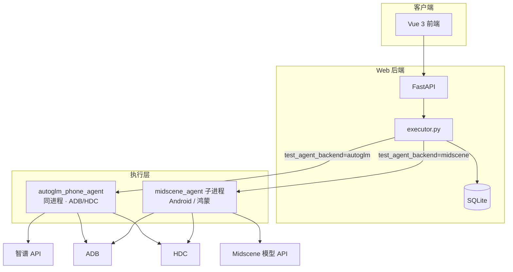

# 测试用例管理平台 — 架构说明（维护向）

本文档描述本仓库的技术架构与目录约定，供初级工程师维护代码时查阅。

## 1. 系统定位

本仓库包含两部分：

1. **`autoglm_phone_agent/`（Python 包）**  
   基于 **OpenAI 兼容 API**（智谱 AutoGLM-Phone）的移动端 UI 自动化：观察→推理→执行循环。设备层通过 **`device_factory`** 支持 **Android（ADB）** 与 **鸿蒙（HDC + uitest）**，实现参考 [Open-AutoGLM](https://github.com/zai-org/Open-AutoGLM)。详见 [`autoglm_phone_agent/README.md`](./autoglm_phone_agent/README.md)。

2. **`web/`（Web 应用）**  
   **前端**：测试用例 CRUD、触发执行、轮询展示步骤日志与结果。  
   **后端**：用户注册/登录（JWT）、用例与执行记录持久化；后台线程按机器人实例的引擎×平台路由 Agent。

CLI 入口：仓库根目录 **`main.py`**（`--device-type adb|hdc`），与 Web 共用 `autoglm_phone_agent`。

**`midscene_agent/`（Node）** 提供 Android（`@midscene/android`）与鸿蒙（`@midscene/harmony`）的视觉自动化；与 AutoGLM 通过 Web 机器人实例的「执行引擎 × 设备平台」组合路由。

### 1.1 执行引擎 × 设备平台（机器人实例）

| `test_agent_backend` | `device_platform` | 实际执行链路 |
|----------------------|-------------------|--------------|
| `autoglm` | `android` | `autoglm_phone_agent` + ADB（智谱，参考 [Open-AutoGLM](https://github.com/zai-org/Open-AutoGLM)） |
| `autoglm` | `harmonyos` | `autoglm_phone_agent` + HDC / uitest（同 Open-AutoGLM `--device-type hdc`） |
| `midscene` | `android` | `midscene_agent` + `@midscene/android` |
| `midscene` | `harmonyos` | `midscene_agent` + `@midscene/harmony`（千问/GLM 等） |

- 字段定义：`robot_instances.test_agent_backend`、`robot_instances.device_platform`（**默认**执行平台，可在用例页被覆盖）
- 解析与路由：`web/backend/app/services/device_platform.py`、`web/backend/app/executor.py`
- YAML 用例仅允许 `test_agent_backend=midscene`（平台可为 android 或 harmonyos）

### 1.2 用例执行时的设备选择（平台 + 终端）

同一机器人实例**不必**为 Android / 鸿蒙各租一台；执行前在「测试用例」页动态指定：

| 层级 | 字段 / UI | 说明 |
|------|-----------|------|
| 实例默认 | `robot_instances.device_platform` | 「我的机器人」中配置的默认平台（Android / 鸿蒙） |
| 本次平台 | 请求体 `device_platform` → `test_runs.device_platform` | 用例页「本次执行设备」；未传则用实例默认 |
| 本次终端 | 请求体 `device_id` → `test_runs.device_id` | 用例页「目标终端」；ADB serial 或 HDC target ID |
| 环境兜底 | `ADB_DEVICE_ID` / `HDC_DEVICE_ID` | 未在界面选择终端时使用 |

- **枚举在线设备**：`GET /api/devices/connected?platform=android|harmonyos`（`adb devices -l` / `hdc list targets`），实现见 `app/services/device_discovery.py`。
- **投屏**：`GET /api/robot-instances/{id}/device-screen?device_platform=&device_id=`，与本次执行选择一致。
- **解析**：`resolve_execution_platform()`、`resolve_execution_device_id()`（`device_platform.py`）。
- 前端在 `CasesView.vue` 选择机器人 / 平台 / 终端；浏览器 `sessionStorage` 按实例记住上次平台与终端。

## 2. 技术栈总览

| 层级 | 技术 | 语言 |
|------|------|------|
| 前端框架 | Vue 3（Composition API） | JavaScript |
| 前端构建 | Vite 6 | JS / Node |
| 前端路由 | Vue Router 4 | JS |
| 前端状态 | Pinia | JS |
| HTTP 客户端 | Axios | JS |
| 后端框架 | FastAPI | Python 3 |
| ASGI 服务器 | Uvicorn（`standard`） | Python |
| ORM | SQLAlchemy 2.x | Python |
| 校验 / Schema | Pydantic v2 | Python |
| 认证 | JWT（`python-jose`）+ 密码哈希（`bcrypt`） | Python |
| 数据库 | SQLite（文件库） | — |
| Agent / LLM | `openai` 官方 SDK（兼容 OpenAI 风格 Base URL） | Python |
| 图像 | Pillow（`PIL`，Agent 侧截图等） | Python |
| 设备 | ADB（Android）、HDC（鸿蒙） | — |
| 视觉自动化 | Midscene.js（`@midscene/android`、`@midscene/harmony`） | TypeScript / Node |

依赖清单：

- AutoGLM Agent（根目录）：`requirements.txt`
- Midscene Agent：`midscene_agent/package.json`
- Web 后端：`web/backend/requirements.txt`
- Web 前端：`web/frontend/package.json`

## 3. 目录结构

```
autoglm-phone-test-agent/          # 仓库根目录
├── ARCHITECTURE.md                # 本文档
├── autoglm_phone_agent/           # AutoGLM-Phone（Android/ADB + 鸿蒙/HDC）
│   ├── device/device_factory.py
│   ├── device/adb_bridge.py
│   ├── device/hdc_bridge.py
│   └── config/apps_harmonyos.py
├── midscene_agent/                # Midscene 视觉自动化（Android + HarmonyOS）
│   └── src/
│       ├── agent.ts               # MidsceneTestAgent（跨平台）
│       ├── device_runtime.ts      # Android / 鸿蒙设备层
│       ├── platform.ts            # 平台与引擎类型
│       └── cli.ts                 # CLI；--web-dispatch 供 Web 子进程
├── main.py                        # AutoGLM CLI
├── requirements.txt
└── web/
    ├── frontend/                  # Vue + Vite
    │   ├── src/
    │   │   ├── api/client.js      # Axios，BASE_URL / 代理
    │   │   ├── stores/auth.js     # Token、登录态
    │   │   ├── router/index.js    # 路由与登录守卫
    │   │   └── views/             # Login / Register / Cases
    │   ├── vite.config.js         # dev 代理 /api → 8000
    │   └── package.json
    └── backend/
        ├── app/
        │   ├── main.py            # FastAPI 入口、CORS、挂载路由
        │   ├── database.py        # SQLite 路径、engine、ensure_schema
        │   ├── models.py          # User / TestCase / TestRun
        │   ├── schemas.py         # Pydantic 出入参
        │   ├── deps.py            # get_current_user（JWT）
        │   ├── auth_utils.py      # 密码、JWT
        │   ├── executor.py        # 按引擎×平台路由 AutoGLM / Midscene
        │   ├── services/
        │   │   ├── device_platform.py   # 平台/终端解析（实例默认 + 本次覆盖）
        │   │   ├── device_discovery.py  # adb devices / hdc list targets
        │   │   └── device_screen.py     # 投屏：ADB / HDC
        │   └── routers/
        │       ├── auth.py
        │       ├── test_cases.py
        │       ├── robot_instances.py
        │       ├── devices.py           # GET /devices/connected
        │       └── admin.py             # 租用审批 → 实例化 + 引擎/平台
        ├── requirements.txt       # Web 后端依赖
        └── data/tcm.db            # 默认 SQLite（可通过环境变量改路径）
```

## 4. 运行时架构

下图概括 **浏览器前端**、**FastAPI 后端**、**同进程内的 `autoglm_phone_agent`** 以及 **CLI** 的调用关系；与下文 4.1–4.4 中的端口、HTTP 轮询、执行链路与 WebSocket 监控一致。开发环境下浏览器到后端的 HTTP 常经 Vite 将 `/api` 代理到 Uvicorn（见 4.1）。



说明：机器人实例字段 **`test_agent_backend`** × **`device_platform`** 决定走 `PhoneTestAgent` 还是 `midscene_agent` CLI（`--web-dispatch`）。详见 §1.1。

### 4.1 进程与端口（典型本地开发）

| 组件 | 默认端口 | 说明 |
|------|-----------|------|
| Vite 开发服务器 | 5173 | 浏览器访问前端 |
| Uvicorn（FastAPI） | 8000 | 浏览器通常不直连；`/api` 由 Vite **proxy** 到 8000 |

前端 Axios 使用 `VITE_API_BASE`（可为空）。开发时常为空，请求走同源 `/api`，由 Vite 转发到后端。

### 4.2 请求链路（登录后）

1. 浏览器 → `POST /api/auth/login`（或 register）→ 返回 JWT。  
2. 前端 `localStorage` 存 token，后续请求 `Authorization: Bearer ...`。  
3. 用例列表 → `GET /api/test-cases`。  
4. 执行 → `POST /api/test-cases/{id}/run`：请求体含 `robot_instance_id`，可选 `device_platform`、`device_id`；创建 `TestRun` 后**异步**在线程池执行 `executor.execute_test_run`。  
5. 执行前枚举设备 → `GET /api/devices/connected?platform=…`（用例页「目标终端」下拉）。  
6. 前端轮询 → `GET /api/test-cases/runs/{run_id}` 获取 `status`、`step_log`、`output_message` 等。

### 4.3 执行链路（核心）

1. `POST /api/test-cases/{id}/run` 携带 `robot_instance_id`；可选 `device_platform`、`device_id` 覆盖本次执行目标。  
2. 后端合并实例默认与本次参数：`resolve_execution_platform()`、`resolve_execution_device_id()`，写入 `test_runs.device_platform`、`test_runs.device_id`。  
3. 读取实例 `test_agent_backend`；**YAML 用例**要求 `midscene`，否则直接失败。  
4. 路由分支（`executor.py`）：  
   - **`autoglm`**：`run_phone_agent_task(device_platform=…, device_id=…)` → 同进程 `PhoneTestAgent`；`create_device()` → `AdbBridge` / `HdcBridge`。  
   - **`midscene`**：子进程 `midscene_agent` CLI；`stdin` JSON 含 `device_platform`、`device_id`、`execution_mode` 等；子进程环境同步设置 `ADB_DEVICE_ID` / `HDC_DEVICE_ID`。  
5. Midscene stdout 每行 JSON（`kind: meta|step|done`）→ `step_log`；成功可写 `report_path`。  
6. 取消：`threading.Event` + `POST …/runs/{id}/cancel`。  
7. 投屏：`GET …/device-screen?device_platform=&device_id=`，与用例页当前选择一致（`device_screen.py`）。

### 4.4 WebSocket 运行监控（大屏）

1. 浏览器打开 `/monitor`（仅 `platform_admin` / `tse`），使用 **同源 WebSocket** `ws(s)://…/api/ws/monitor/robots?token=<JWT>`（开发时走 Vite `/api` 代理，`vite.config.js` 需 `ws: true`）。  
2. 后端 `accept` 后校验 JWT 与角色，随后按固定间隔（约 2s）推送 JSON：`online`、`idle`、`executing`；其中 **executing** 与库表 `test_runs` 中 `status=running` 条数一致，**idle** 等可由 `app/services/robot_monitor.py` 占位模拟，对接 Agent 管理服务后改为拉取/订阅同一指标源。  
3. 断线后前端可指数退避重连，用于展示与运营值守场景。

## 5. 数据存储

- **SQLite**  
  - 默认路径见 `web/backend/app/database.py`：相对仓库根解析为 `web/backend/data/tcm.db`。  
  - 环境变量 **`TCM_SQLITE_PATH`** 可覆盖文件路径。  
  - `check_same_thread=False`：允许后台线程与主线程共用连接池（后台执行 Agent）。  

- **表（逻辑）**  
  - `users`：账号与密码哈希、RBAC `role` 等。  
  - `projects`：项目空间（被测应用、测试目标），多租户按 `owner_id`。  
  - `test_cases`：归属 `project_id`；标题、执行说明、前置条件、`steps_json`（步骤与预期）、优先级、`revision_no`。  
  - `test_case_revisions`：每次保存的快照（版本管理）。  
  - `case_kb_documents`：检索用扁平文本（标题/步骤/说明聚合），供 `/api/knowledge/cases/search`。  
  - `robot_instances`：租用实例化后的数字机器人；`instance_code`（DR-xxxxxx）、`test_agent_backend`、`device_platform`（**默认**平台）、`catalog_robot_id` 等。  
  - `test_runs`：`robot_instance_id`、`device_platform` / `device_id`（**本次**执行实际使用）、`pending` / `running` / `success` / `failed` / `cancelled`、`step_log`、`report_path`（Midscene HTML）、`output_message`、`error_trace`。  
  - `project_reports`：项目维度测试报告摘要（供看板「最新报告」）。  
  - `defects`：缺陷（开放/已解决时间），供看板「未处理缺陷存量」趋势。  
  - `billing_preorders`：机器人商城「立即租用」生成的预订单（`pending_payment` 等），对接支付网关前由计费模块写入。  
  - `project_app_artifacts`：项目内上传的安装包路径；`test_case_sets` / `test_case_set_items`：用例集合；`functional_dispatch_tasks`：功能测试下发任务及 Kafka 投递状态快照。

## 6. 外部依赖与环境变量

| 变量（示例） | 用途 |
|----------------|------|
| `BIGMODEL_API_KEY` / `ZHIPU_API_KEY` | AutoGLM（Android / 鸿蒙均使用） |
| `OPENAI_BASE_URL` | 智谱网关等 |
| `PHONE_AGENT_MODEL` / `PHONE_AGENT_MAX_STEPS` | AutoGLM 模型与步数上限 |
| `PHONE_AGENT_DEVICE_TYPE` | CLI 默认设备类型：`adb` \| `hdc`（同 Open-AutoGLM） |
| `ADB_DEVICE_ID` | Android 默认 serial；用例页「目标终端」可覆盖 |
| `MIDSCENE_MODEL_*` / `DASHSCOPE_API_KEY` | Midscene 视觉模型（千问等） |
| `HDC_DEVICE_ID` / `HDC_HOME` | 鸿蒙默认 target / hdc 路径；用例页可覆盖 |
| `MIDSCENE_DEVICE_PLATFORM` | CLI 覆盖平台：`android` \| `harmonyos` |
| `MIDSCENE_AGENT_BACKEND` | Web 子进程覆盖：`autoglm` \| `midscene` |
| `JWT_SECRET` / `TCM_SQLITE_PATH` | Web 认证与库路径 |

设备要求：

- **AutoGLM + Android**：USB 调试、ADB、设备上 [ADB Keyboard](https://github.com/senzhk/ADBKeyBoard)（文本输入）。
- **AutoGLM + 鸿蒙**：HDC、`hdc list targets` 可见设备；使用 `uitest` 原生输入（无需 ADB Keyboard）。
- **Midscene**：见 [`midscene_agent/README.md`](./midscene_agent/README.md)。

详见 [`autoglm_phone_agent/README.md`](./autoglm_phone_agent/README.md)。

## 7. 初级工程师维护清单

0. **业务功能或模块职责变更**：同步更新仓库根目录 **README.md**（模块介绍与启动方式）；本文档负责架构级细节与深度链路说明。  
1. **改前端**：只动 `web/frontend`，`npm install` 后 `npm run dev`；接口路径以 `/api` 开头。  
2. **改后端**：`web/backend`，建议使用虚拟环境，`pip install -r requirements.txt`，ASGI 入口为 `app.main:app`。  
3. **改 AutoGLM**：`autoglm_phone_agent/`（`device_factory`、`hdc_bridge` 等）；影响所有 `test_agent_backend=autoglm` 的执行。  
4. **改 Midscene**：`midscene_agent/`；`npm run typecheck`；影响 `test_agent_backend=midscene`；改完后重启 Uvicorn。长时间任务不建议 `uvicorn --reload`。  
5. **改机器人路由**：`executor.py`、`services/device_platform.py`；实例字段见 `models.RobotInstance`。  
6. **数据库**：无 Alembic；列迁移在 `database.ensure_schema()`（如 `robot_instances.device_platform`）。  
7. **排查执行失败**：确认实例 **引擎**、用例页 **平台+终端** 与用例格式（YAML→Midscene）；`adb devices` / `hdc list targets` 与所选 `device_id` 一致；看 `test_runs.device_platform`、`device_id`、`error_trace`、`step_log`；Midscene 报告见 `report_path`。

## 8. 一句话小结

**Vue 3 + FastAPI + SQLite** 管理用例与租用机器人实例；执行前可按实例选择 **Android/鸿蒙平台** 与 **具体终端（多机）**；**AutoGLM** 同进程、**Midscene** 子进程均支持双平台；前端轮询步骤日志、Midscene 报告与按终端投屏。
