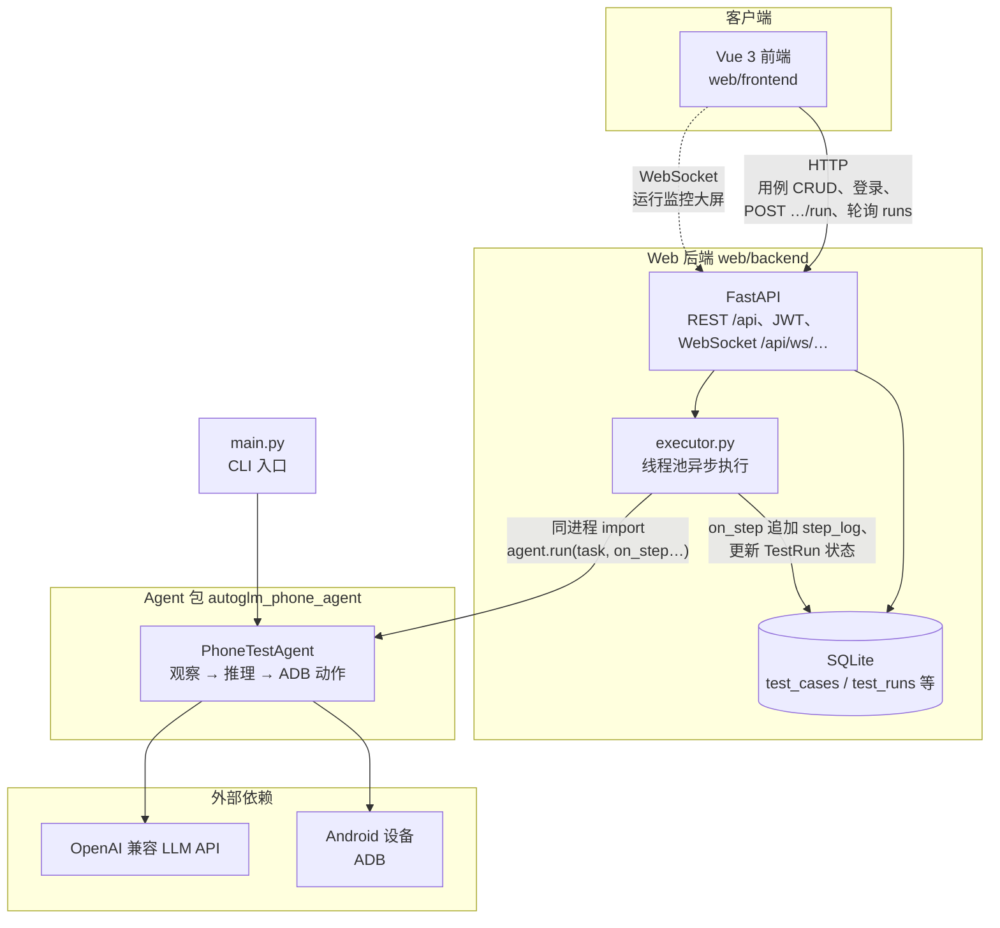

# 测试用例管理平台 — 架构说明（维护向）

本文档描述本仓库的技术架构与目录约定，供初级工程师维护代码时查阅。

## 1. 系统定位

本仓库包含两部分：

1. **`autoglm_phone_agent/`（Python 包）**  
   基于 **OpenAI 兼容 API**（如智谱 BigModel）与 **ADB** 的 Android 端 UI 自动化代理（观察→推理→执行循环）。

2. **`web/`（Web 应用）**  
   **前端**：测试用例 CRUD、触发执行、轮询展示步骤日志与结果。  
   **后端**：用户注册/登录（JWT）、用例与执行记录持久化、在后台线程中**同进程调用**上述 Agent。

CLI 入口：仓库根目录 **`main.py`**，与 Web 共用同一套 `autoglm_phone_agent`。

## 2. 技术栈总览

| 层级 | 技术 | 语言 |
|------|------|------|
| 前端框架 | Vue 3（Composition API） | JavaScript |
| 前端构建 | Vite 6 | JS / Node |
| 前端路由 | Vue Router 4 | JS |
| 前端状态 | Pinia | JS |
| HTTP 客户端 | Axios | JS |
| 后端框架 | FastAPI | Python 3 |
| ASGI 服务器 | Uvicorn（`standard`） | Python |
| ORM | SQLAlchemy 2.x | Python |
| 校验 / Schema | Pydantic v2 | Python |
| 认证 | JWT（`python-jose`）+ 密码哈希（`bcrypt`） | Python |
| 数据库 | SQLite（文件库） | — |
| Agent / LLM | `openai` 官方 SDK（兼容 OpenAI 风格 Base URL） | Python |
| 图像 | Pillow（`PIL`，Agent 侧截图等） | Python |
| 设备 | ADB（外部命令行） | — |

依赖清单：

- Agent（根目录）：`requirements.txt`
- Web 后端：`web/backend/requirements.txt`
- Web 前端：`web/frontend/package.json`

## 3. 目录结构

```
autoglm-phone-test-agent/          # 仓库根目录
├── ARCHITECTURE.md                # 本文档
├── autoglm_phone_agent/           # 核心 Agent：agent、model、actions、device
├── main.py                        # CLI：命令行跑任务
├── requirements.txt               # Agent CLI 依赖
└── web/
    ├── frontend/                  # Vue + Vite
    │   ├── src/
    │   │   ├── api/client.js      # Axios，BASE_URL / 代理
    │   │   ├── stores/auth.js     # Token、登录态
    │   │   ├── router/index.js    # 路由与登录守卫
    │   │   └── views/             # Login / Register / Cases
    │   ├── vite.config.js         # dev 代理 /api → 8000
    │   └── package.json
    └── backend/
        ├── app/
        │   ├── main.py            # FastAPI 入口、CORS、挂载路由
        │   ├── database.py        # SQLite 路径、engine、ensure_schema
        │   ├── models.py          # User / TestCase / TestRun
        │   ├── schemas.py         # Pydantic 出入参
        │   ├── deps.py            # get_current_user（JWT）
        │   ├── auth_utils.py      # 密码、JWT
        │   ├── executor.py        # 线程池里跑 Agent，写 step_log / 状态
        │   └── routers/
        │       ├── auth.py
        │       └── test_cases.py
        ├── requirements.txt       # Web 后端依赖
        └── data/tcm.db            # 默认 SQLite（可通过环境变量改路径）
```

## 4. 运行时架构

下图概括 **浏览器前端**、**FastAPI 后端**、**同进程内的 `autoglm_phone_agent`** 以及 **CLI** 的调用关系；与下文 4.1–4.4 中的端口、HTTP 轮询、执行链路与 WebSocket 监控一致。开发环境下浏览器到后端的 HTTP 常经 Vite 将 `/api` 代理到 Uvicorn（见 4.1）。



说明：**Web 路径**下 Agent 仅由后端 `executor` 在后台线程中拉起，前端不直连 LLM 或 ADB；**CLI 路径**下跳过 Web，直接调用同一 `PhoneTestAgent` 包。

### 4.1 进程与端口（典型本地开发）

| 组件 | 默认端口 | 说明 |
|------|-----------|------|
| Vite 开发服务器 | 5173 | 浏览器访问前端 |
| Uvicorn（FastAPI） | 8000 | 浏览器通常不直连；`/api` 由 Vite **proxy** 到 8000 |

前端 Axios 使用 `VITE_API_BASE`（可为空）。开发时常为空，请求走同源 `/api`，由 Vite 转发到后端。

### 4.2 请求链路（登录后）

1. 浏览器 → `POST /api/auth/login`（或 register）→ 返回 JWT。  
2. 前端 `localStorage` 存 token，后续请求 `Authorization: Bearer ...`。  
3. 用例列表 → `GET /api/test-cases`。  
4. 执行 → `POST /api/test-cases/{id}/run`：创建 `TestRun`，**异步**在线程池中执行 `executor.execute_test_run`。  
5. 前端轮询 → `GET /api/test-cases/runs/{run_id}` 获取 `status`、`step_log`、`output_message` 等。

### 4.3 执行链路（核心）

1. `executor.run_phone_agent_task` 将仓库根目录加入 `sys.path`，`chdir` 到仓库根，读取根目录 `.env`。  
2. 实例化 `PhoneTestAgent`，调用 `agent.run(task, on_step=..., should_cancel=...)`。  
3. `on_step` 将每步结果以 **JSON Lines** 追加到 `TestRun.step_log` 并 `commit`。  
4. 取消：`threading.Event` + `POST /api/test-cases/runs/{id}/cancel`；Agent 在**步与步之间**检查是否取消。  
5. 返回 `AgentRunOutcome(ok, message)`：后端据此写入 `success` / `failed`（取消为 `cancelled`）。

### 4.4 WebSocket 运行监控（大屏）

1. 浏览器打开 `/monitor`（仅 `platform_admin` / `tse`），使用 **同源 WebSocket** `ws(s)://…/api/ws/monitor/robots?token=<JWT>`（开发时走 Vite `/api` 代理，`vite.config.js` 需 `ws: true`）。  
2. 后端 `accept` 后校验 JWT 与角色，随后按固定间隔（约 2s）推送 JSON：`online`、`idle`、`executing`；其中 **executing** 与库表 `test_runs` 中 `status=running` 条数一致，**idle** 等可由 `app/services/robot_monitor.py` 占位模拟，对接 Agent 管理服务后改为拉取/订阅同一指标源。  
3. 断线后前端可指数退避重连，用于展示与运营值守场景。

## 5. 数据存储

- **SQLite**  
  - 默认路径见 `web/backend/app/database.py`：相对仓库根解析为 `web/backend/data/tcm.db`。  
  - 环境变量 **`TCM_SQLITE_PATH`** 可覆盖文件路径。  
  - `check_same_thread=False`：允许后台线程与主线程共用连接池（后台执行 Agent）。  

- **表（逻辑）**  
  - `users`：账号与密码哈希、RBAC `role` 等。  
  - `projects`：项目空间（被测应用、测试目标），多租户按 `owner_id`。  
  - `test_cases`：归属 `project_id`；标题、执行说明、前置条件、`steps_json`（步骤与预期）、优先级、`revision_no`。  
  - `test_case_revisions`：每次保存的快照（版本管理）。  
  - `case_kb_documents`：检索用扁平文本（标题/步骤/说明聚合），供 `/api/knowledge/cases/search`。  
  - `test_runs`：`pending` / `running` / `success` / `failed` / `cancelled`、`step_log`（文本）、`output_message`、`error_trace`、时间戳。  
  - `project_reports`：项目维度测试报告摘要（供看板「最新报告」）。  
  - `defects`：缺陷（开放/已解决时间），供看板「未处理缺陷存量」趋势。  
  - `billing_preorders`：机器人商城「立即租用」生成的预订单（`pending_payment` 等），对接支付网关前由计费模块写入。  
  - `project_app_artifacts`：项目内上传的安装包路径；`test_case_sets` / `test_case_set_items`：用例集合；`functional_dispatch_tasks`：功能测试下发任务及 Kafka 投递状态快照。

## 6. 外部依赖与环境变量

| 变量（示例） | 用途 |
|----------------|------|
| `BIGMODEL_API_KEY` / `ZHIPU_API_KEY` | 智谱等 OpenAI 兼容 API Key |
| `OPENAI_BASE_URL` | 默认智谱 Paas 地址，可改为其他兼容网关 |
| `PHONE_AGENT_MODEL` | 模型名，如 `autoglm-phone` |
| `PHONE_AGENT_MAX_STEPS` | 单任务最大步数 |
| `ADB_DEVICE_ID` | 多设备时指定序列号 |
| `JWT_SECRET` / `JWT_EXPIRE_MINUTES` | 后端签发 JWT |
| `TCM_SQLITE_PATH` | 自定义 SQLite 文件路径 |

Agent 运行还需要：**USB 调试、ADB、设备上 ADB Keyboard（文本输入）** 等，详见 `autoglm_phone_agent` 包内说明。

## 7. 初级工程师维护清单

0. **业务功能或模块职责变更**：同步更新仓库根目录 **README.md**（模块介绍与启动方式）；本文档负责架构级细节与深度链路说明。  
1. **改前端**：只动 `web/frontend`，`npm install` 后 `npm run dev`；接口路径以 `/api` 开头。  
2. **改后端**：`web/backend`，建议使用虚拟环境，`pip install -r requirements.txt`，ASGI 入口为 `app.main:app`。  
3. **改 Agent**：`autoglm_phone_agent/`；Web 执行时会 import 仓库根包，改完后需重启 Uvicorn；长时间任务不建议使用 `uvicorn --reload`（保存代码会重启进程并中断后台任务）。  
4. **数据库**：当前无 Alembic；新增列可通过 `ensure_schema()` 或手写 `ALTER TABLE`；新建表可用 `Base.metadata.create_all`。  
5. **排查执行失败**：先看 `test_runs.error_trace`，再看 `step_log` 每步的 `success` / `message`；区分 **Python 异常**（通常 `failed` + traceback）与 **`AgentRunOutcome.ok=false`**（逻辑失败，`output_message` 中有说明）。

## 8. 一句话小结

**Vue 3 + Vite** 前端通过 **FastAPI + SQLite** 管理用户与用例，在 **后台线程** 中调用 **autoglm_phone_agent**（**OpenAI SDK + ADB + Pillow**），用 **轮询** 展示步骤；认证为 **JWT**，密码 **bcrypt**。
