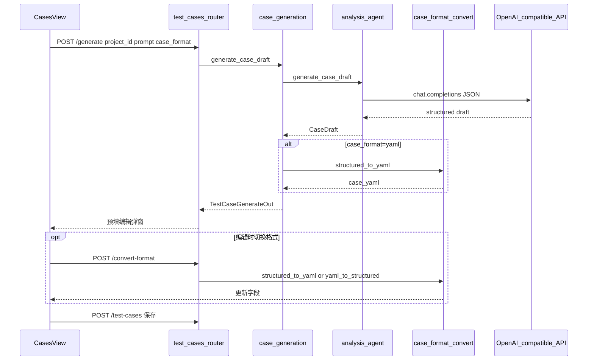
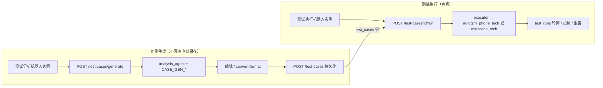
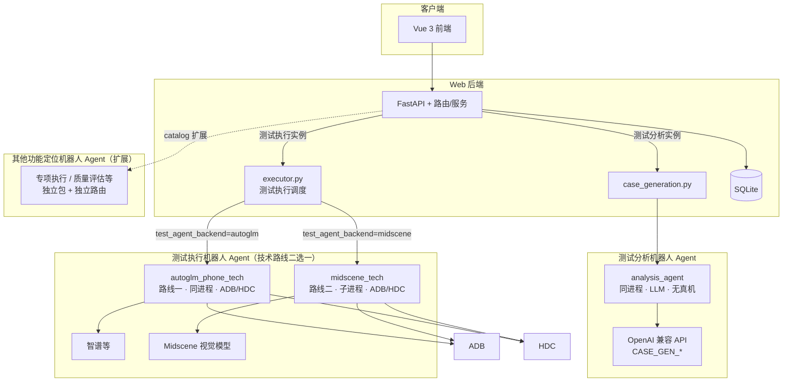

# 测试用例管理平台 — 架构说明（维护向）

本文档描述本仓库的技术架构与目录约定，供初级工程师维护代码时查阅。

## 1. 系统定位

### 1.0 数字机器人 × Agent 边界（概念与扩展）

Web 将租用的**数字机器人实例**按商城 **功能定位（`catalog_robot_id` 等）** 区分能力；**FastAPI 按实例类型把请求路由到不同的 Agent 实现**。与本仓库源码直接对应的归类如下：

| 业务定位（示例） | 代码侧 Agent | 说明 |
|------------------|--------------|------|
| **测试分析机器人** | `analysis_agent/` | 用例生成、自然语言 → structured 等；**不连接真机**；在 Web 后端进程内调 LLM（`CASE_GEN_*`） |
| **测试执行机器人（func_agent）** | `func_agent/`（内含 `autoglm_phone_tech/` 与 `midscene_tech/` 技术后端） | **同一业务定位下的两条技术路线**：LLM 驱动 UI（智谱 AutoGLM-Phone）与视觉驱动 UI（Midscene.js）。由实例字段 **`test_agent_backend`**（`autoglm` \| `midscene`）与 **`device_platform`** 在 `executor.py` 中择路；均经 ADB/HDC 操作真机 |
| **其他功能定位**（专项执行、质量评估等） | 未来各自 **独立 Agent 包 + 路由/服务** | 与 `case_generation`、`executor` 平行扩展；本架构图以虚线占位，不展开具体实现 |

**要点**：`autoglm_phone_tech` 与 `midscene_tech` 在业务上统一归属 **`func_agent`（功能测试机器人）**，不是与「测试分析」并列的第三、第四种「机器人类型」；后续若增加新的测试执行技术路线，仍在 `func_agent` 域内扩展并由 `executor` 分支选择。

本仓库还包含：

1. **`analysis_agent/`（Python）** — **测试分析机器人 Agent**：OpenAI 兼容 API 产出 structured 用例草稿；与设备无关。Web 适配见 `app/services/case_generation.py`。详见 [`analysis_agent/README.md`](./analysis_agent/README.md)。

2. **`func_agent/`（Python）** — **功能测试机器人统一业务域**：向 `executor` 暴露统一调度入口；内部编排两条后端路线（AutoGLM / Midscene）。

3. **`autoglm_phone_tech/`（Python）** 与 **`midscene_tech/`（Node）** — **func_agent 技术后端实现**：前者为观察→推理→执行（ADB/HDC），后者为视觉自动化（`@midscene/android` / `@midscene/harmony`，Web 子进程 `--web-dispatch`）。

4. **`web/`（Web 应用）**  
   **前端**：项目与用例 CRUD、自动生成草稿、触发执行、轮询步骤日志与结果。  
   **后端**：认证与持久化；**测试分析**走 `case_generation` → `analysis_agent`；**测试执行**走 `executor` → AutoGLM 同进程或 Midscene 子进程。

5. **`mai_ui_tech/`（Python）** — **GUI Grounding 技术路线**：本地 MAI-UI 推理与坐标解析；由 Web 服务 `mai_ui_service.py` 对接 `/api/mai-ui/*` 能力。

### 1.1 测试执行：技术路线 × 设备平台（`test_agent_backend` × `device_platform`）

下列矩阵描述 **测试执行机器人** 在选定实例后，如何落到底层包与设备（**不是**测试分析机器人的行为）：

| 技术路线 `test_agent_backend` | `device_platform` | 实际执行链路 |
|----------------------|-------------------|--------------|
| `autoglm` | `android` | `autoglm_phone_tech` + ADB（智谱，参考 [Open-AutoGLM](https://github.com/zai-org/Open-AutoGLM)） |
| `autoglm` | `harmonyos` | `autoglm_phone_tech` + HDC / uitest（同 Open-AutoGLM `--device-type hdc`） |
| `midscene` | `android` | `midscene_tech` + `@midscene/android` |
| `midscene` | `harmonyos` | `midscene_tech` + `@midscene/harmony`（千问/GLM 等） |

- 字段定义：`robot_instances.test_agent_backend`、`robot_instances.device_platform`（**默认**执行平台，可在用例页被覆盖）
- 解析与路由：`web/backend/app/services/device_platform.py`、`web/backend/app/executor.py`
- YAML 用例仅允许 `test_agent_backend=midscene`（平台可为 android 或 harmonyos）

### 1.2 测试执行时的设备选择（平台 + 终端）

同一机器人实例**不必**为 Android / 鸿蒙各租一台；执行前在「测试用例」页动态指定：

| 层级 | 字段 / UI | 说明 |
|------|-----------|------|
| 实例默认 | `robot_instances.device_platform` | 「我的机器人」中配置的默认平台（Android / 鸿蒙） |
| 本次平台 | 请求体 `device_platform` → `test_runs.device_platform` | 用例页「本次执行设备」；未传则用实例默认 |
| 本次终端 | 请求体 `device_id` → `test_runs.device_id` | 用例页「目标终端」；ADB serial 或 HDC target ID |
| 环境兜底 | `ADB_DEVICE_ID` / `HDC_DEVICE_ID` | 未在界面选择终端时使用 |

- **枚举在线设备**：`GET /api/devices/connected?platform=android|harmonyos`（`adb devices -l` / `hdc list targets`），实现见 `app/services/device_discovery.py`。
- **投屏**：`GET /api/robot-instances/{id}/device-screen?device_platform=&device_id=`，与本次执行选择一致。
- **解析**：`resolve_execution_platform()`、`resolve_execution_device_id()`（`device_platform.py`）。
- 前端在 `CasesView.vue` 选择机器人 / 平台 / 终端；浏览器 `sessionStorage` 按实例记住上次平台与终端。
- **跨页实时执行**：Pinia `activeTestRun` 轮询 `GET /api/test-cases/runs/{id}`；离开用例页后顶栏可跳转 `/runs/:runId/live`（`RunExecutionLiveView.vue` + `RunLivePanel.vue`）。`RobotInstanceOut.active_run_id` 与 `runtime_status=executing` 供「我的机器人」列表展示 **执行详情** 入口。

### 1.3 测试分析机器人 Agent（`analysis_agent/`）与用例格式（structured / YAML）

与 §1.1 **测试执行** 分离：不调用 `PhoneTestAgent` / `midscene_tech`；LLM 仅在 Web 后端进程内通过 OpenAI 兼容 API 生成 **structured** 字段。

| 项 | 说明 |
|----|------|
| 包 | `analysis_agent/`（`AnalysisAgent`，对齐 `autoglm_phone_tech` 目录约定） |
| Web 适配 | `app/services/case_generation.py`（KB 检索 + ORM → `ProjectContext`） |
| 格式转换 | `app/services/case_format_convert.py`（structured ↔ Midscene YAML，无 LLM） |
| 生成路由 | `POST /api/test-cases/generate`（`TestCaseGenerateIn` → `TestCaseGenerateOut`） |
| 互转路由 | `POST /api/test-cases/convert-format`（`CaseFormatConvertIn` → `CaseFormatConvertOut`） |
| 持久化 | 上述接口**不写库**；用户在前端编辑后 `POST /api/test-cases` 保存 |
| LLM 输出 | 始终 structured（标题、前置条件、步骤 JSON、执行说明、优先级） |
| 生成可选格式 | 请求体 `case_format`：`structured`（默认）或 `yaml`；为 `yaml` 时在 `case_generation` 内调用 `structured_to_yaml()` |
| 编辑互转 | 前端 `CasesView` 切换格式单选 → 确认 → `convert-format` |
| 上下文 | `Project.name`、`tested_app_name`、`test_objective` + 用户 `prompt`（用户描述优先于项目被测应用名） |
| RAG | `CASE_GEN_USE_KB=true` 时调用 `case_kb.search_cases_kb`（同项目、同租户 scope） |
| 执行衔接 | structured → `case_agent_text.build_agent_task_text()`（AutoGLM / Midscene natural）；yaml → Midscene `runYaml`（仅 `test_agent_backend=midscene`） |

**structured → YAML 约定**（`structured_to_yaml`）：前置条件 → `ai: 确保满足前置条件：…`；步骤 `description` → `ai:`，`expected` → `aiAssert:`；执行说明 → `ai: 【执行说明】…`；汇总为单条 `tasks[0].flow`。

**YAML → structured**（`yaml_to_structured`）：按上述前缀/标记反向解析；手写或非约定 YAML 为最佳努力，复杂 `flow` 可能需手调。



**配置**：仓库根 `.env` 的 `CASE_GEN_*`。本地调试常用 DeepSeek（`CASE_GEN_BASE_URL=https://api.deepseek.com`、`CASE_GEN_MODEL=deepseek-v4-pro`）；未设 `CASE_GEN_API_KEY` 时回退 `BIGMODEL_API_KEY`。详见 §6 环境变量表。

### 1.4 端到端：测试分析机器人 × 测试执行机器人

平台里至少涉及**两类业务定位的机器人实例**（均可在商城租用），在同一「项目空间」下配合完成「写用例 → 落库 → 真机执行 → 看结果」闭环；**测试执行**内部再选 AutoGLM 或 Midscene 技术路线。二者职责分离，勿在同一操作里选错实例类型。

| 维度 | 测试分析机器人（用例生成） | 测试执行机器人（设备自动化） |
|------|---------------------------|------------------------------|
| 商城目录 / 典型 `catalog_robot_id` | **测试分析**（如 `test_analysis`） | **功能执行**等；实例上 `test_agent_backend`：`autoglm` 或 `midscene`（**两条技术路线**） |
| 对应代码包 | `analysis_agent` | `autoglm_phone_tech` **或** `midscene_tech`（由 `executor` 选择） |
| 是否连真机 | **否** | **是**；ADB/HDC |
| 主要 Web 入口 | 测试用例页 → **创建用例 → 自动生成** | 测试用例页 → 选用例 → **执行测试**（机器人 / 平台 / 目标终端） |
| 关键 API | `POST /api/test-cases/generate`（须传分析实例 `robot_instance_id`）、`POST /api/test-cases/convert-format`、`POST /api/test-cases` 保存 | `POST /api/test-cases/{id}/run`、`GET /api/test-cases/runs/{id}`、`POST …/cancel` |
| 环境变量侧重 | `CASE_GEN_*` | `BIGMODEL_API_KEY` / `ZHIPU_API_KEY`、`MIDSCENE_*`、`ADB_DEVICE_ID` / `HDC_DEVICE_ID` 等 |
| 产出物 | 草稿 → 持久化 `test_cases` | `test_runs` 日志、终态、可选 Midscene HTML 报告 |

**推荐协作顺序（业务视角）**

1. **准备项目**：在「项目空间」填写被测应用、测试目标等，便于生成上下文与 KB 检索（`CASE_GEN_USE_KB=true` 时参考同项目历史用例）。  
2. **租用并启动测试分析实例**：商城租用「测试分析」→ 审批通过后启动实例；在用例页「自动生成」弹窗中选择该实例。  
3. **生成并保存用例**：输入一句话需求 → `generate` 得到草稿 → 在弹窗中核对标题、步骤、执行说明；可在 structured / YAML 间用 `convert-format` 切换 → **保存**写入 `test_cases`。  
4. **租用并启动测试执行实例**：租用「功能执行」类机器人，在「我的机器人」中为实例选择 **技术路线**（AutoGLM / Midscene）与 **默认设备平台**；YAML 用例须 **Midscene** 路线。  
5. **执行与观测**：用例列表选中用例 → 选择执行实例与（可选）**本次平台 / 目标终端** → 发起 `run` → 前端轮询 / 多 Tab 工作台查看实时进度与投屏 → 结束后查看结果与报告下载。



**实现提示**：生成接口校验实例为分析类（`catalog_robot_id` / 目录约定）；执行接口校验实例为执行类且与用例格式、引擎一致。详见 `case_generation.py`、`routers/test_cases.py`、`executor.py`。

## 2. 技术栈总览

| 层级 | 技术 | 语言 |
|------|------|------|
| 前端框架 | Vue 3（Composition API） | JavaScript |
| 前端构建 | Vite 6 | JS / Node |
| 前端路由 | Vue Router 4 | JS |
| 前端状态 | Pinia | JS |
| HTTP 客户端 | Axios | JS |
| 后端框架 | FastAPI | Python 3 |
| ASGI 服务器 | Uvicorn（`standard`） | Python |
| ORM | SQLAlchemy 2.x | Python |
| 校验 / Schema | Pydantic v2 | Python |
| 认证 | JWT（`python-jose`）+ 密码哈希（`bcrypt`） | Python |
| 数据库 | SQLite（文件库） | — |
| Agent / LLM | `openai` 官方 SDK（兼容 OpenAI 风格 Base URL） | Python |
| 图像 | Pillow（`PIL`，Agent 侧截图等） | Python |
| 设备 | ADB（Android）、HDC（鸿蒙） | — |
| 视觉自动化 | Midscene.js（`@midscene/android`、`@midscene/harmony`） | TypeScript / Node |
| GUI Grounding | MAI-UI（本地 MLX / Ollama） | Python |

依赖清单：

- AutoGLM Agent（根目录）：`requirements.txt`
- Midscene Agent：`midscene_tech/package.json`
- Web 后端：`web/backend/requirements.txt`
- Web 前端：`web/frontend/package.json`

## 3. 目录结构

```
autoglm-phone-test-agent/          # 仓库根目录
├── ARCHITECTURE.md                # 本文档
├── analysis_agent/                # 测试分析机器人 Agent（LLM · 无真机）
├── func_agent/                    # 功能测试机器人统一业务域（对外调度入口）
│   ├── orchestrator.py
│   ├── core.py
│   └── backends/
│       ├── autoglm_runner.py
│       ├── autoglm/agent.py
│       └── midscene/runtime.py
├── autoglm_phone_tech/           # func_agent 后端实现 · AutoGLM（Android/ADB + 鸿蒙/HDC）
│   ├── device/device_factory.py
│   ├── device/adb_bridge.py
│   ├── device/hdc_bridge.py
│   └── config/apps_harmonyos.py
├── midscene_tech/                # func_agent 后端实现 · Midscene（Android + HarmonyOS）
│   └── src/
│       ├── agent.ts               # MidsceneTestAgent（跨平台）
│       ├── device_runtime.ts      # Android / 鸿蒙设备层
│       ├── platform.ts            # 平台与引擎类型
│       └── cli.ts                 # CLI；--web-dispatch 供 Web 子进程
├── mai_ui_tech/                  # GUI Grounding 技术路线（MAI-UI）
│   ├── mai_ui_tech/cli.py
│   ├── mai_ui_tech/grounding.py
│   └── scripts/
│       ├── serve_grounding_mlx.sh
│       └── run_cli.sh
├── requirements.txt
└── web/
    ├── frontend/                  # Vue + Vite
    │   ├── src/
    │   │   ├── api/client.js      # Axios，BASE_URL / 代理
    │   │   ├── stores/auth.js     # Token、登录态
    │   │   ├── router/index.js    # 路由与登录守卫
    │   │   └── views/             # Login / Register / Cases
    │   ├── vite.config.js         # dev 代理 /api → 8000
    │   └── package.json
    └── backend/
        ├── app/
        │   ├── main.py            # FastAPI 入口、CORS、挂载路由
        │   ├── database.py        # SQLite 路径、engine、ensure_schema
        │   ├── models.py          # User / TestCase / TestRun
        │   ├── schemas.py         # Pydantic 出入参
        │   ├── deps.py            # get_current_user（JWT）
        │   ├── auth_utils.py      # 密码、JWT
        │   ├── executor.py        # 测试执行：按 test_agent_backend × 平台路由两技术路线
        │   ├── services/
        │   │   ├── case_generation.py   # Web 适配 → analysis_agent；可选转 YAML
        │   │   ├── case_format_convert.py  # structured ↔ Midscene YAML
        │   │   ├── case_agent_text.py   # structured → 执行用自然语言
        │   │   ├── case_kb.py           # 用例 KB 扁平检索（RAG 参考）
        │   │   ├── case_yaml.py         # YAML 校验与默认模板
        │   │   ├── device_platform.py   # 平台/终端解析（实例默认 + 本次覆盖）
        │   │   ├── device_discovery.py  # adb devices / hdc list targets
        │   │   └── device_screen.py     # 投屏：ADB / HDC
        │   └── routers/
        │       ├── auth.py
        │       ├── test_cases.py
        │       ├── robot_instances.py
        │       ├── devices.py           # GET /devices/connected
        │       └── admin.py             # 租用审批 → 实例化 + 引擎/平台
        ├── requirements.txt       # Web 后端依赖
        └── data/tcm.db            # 默认 SQLite（可通过环境变量改路径）
```

## 4. 运行时架构

下图按 **§1.0** 的概念分层：**测试分析机器人 Agent**（`analysis_agent`）与 **测试执行机器人 Agent**（`autoglm_phone_tech` / `midscene_tech` 两条技术路线）均经 FastAPI 接入；**其他功能定位**的机器人以虚线占位，表示未来可平行扩展独立 Agent 与路由。与 §4.1–§4.4 的端口、HTTP 轮询、执行链路与 WebSocket 监控一致。开发环境下浏览器 HTTP 常经 Vite 将 `/api` 代理到 Uvicorn（见 4.1）。



说明：**测试执行**侧由实例字段 **`test_agent_backend`** × **`device_platform`** 在 `executor` 内选择 **func_agent** 的具体后端（AutoGLM / Midscene，详见 §1.1）。**测试分析**不经 `executor`。CLI 入口统一为 `python -m func_agent.cli`。

### 4.1 进程与端口（典型本地开发）

| 组件 | 默认端口 | 说明 |
|------|-----------|------|
| Vite 开发服务器 | 5173 | 浏览器访问前端 |
| Uvicorn（FastAPI） | 8000 | 浏览器通常不直连；`/api` 由 Vite **proxy** 到 8000 |

前端 Axios 使用 `VITE_API_BASE`（可为空）。开发时常为空，请求走同源 `/api`，由 Vite 转发到后端。

### 4.2 请求链路（登录后）

1. 浏览器 → `POST /api/auth/login`（或 register）→ 返回 JWT。  
2. 前端 `localStorage` 存 token，后续请求 `Authorization: Bearer ...`。  
3. 用例列表 → `GET /api/test-cases`。
3b. **AI 生成草稿** → `POST /api/test-cases/generate`（可选 `case_format`）；`case_generation.generate_case_draft` 调用 `analysis_agent.AnalysisAgent`；若需 YAML 则 `case_format_convert.structured_to_yaml`；KB 在 Web 层检索后注入；**不写库**；前端预填编辑后 `POST /api/test-cases` 保存。编辑时切换格式 → `POST /api/test-cases/convert-format`。须使用**测试分析**类机器人实例；与步骤 4 的执行实例**不是同一角色**（见 §1.4）。
4. 执行 → `POST /api/test-cases/{id}/run`：请求体含 `robot_instance_id`，可选 `device_platform`、`device_id`；创建 `TestRun` 后**异步**在线程池执行 `executor.execute_test_run`。  
5. 执行前枚举设备 → `GET /api/devices/connected?platform=…`（用例页「目标终端」下拉）。  
6. 前端轮询 → `GET /api/test-cases/runs/{run_id}` 获取 `status`、`step_log`、`output_message` 等。

### 4.3 执行链路（测试执行机器人 · 核心）

1. `POST /api/test-cases/{id}/run` 携带 `robot_instance_id`；可选 `device_platform`、`device_id` 覆盖本次执行目标。  
2. 后端合并实例默认与本次参数：`resolve_execution_platform()`、`resolve_execution_device_id()`，写入 `test_runs.device_platform`、`test_runs.device_id`。  
3. 读取实例 `test_agent_backend`（**测试执行**技术路线）；**YAML 用例**仅允许 **`midscene`** 路线，否则直接失败。  
4. 路由分支（`executor.py`）：  
   - **统一入口**：`run_func_agent_dispatch(FuncAgentDispatch(...))`。  
   - **`autoglm` 后端**：进入 `func_agent.backends.autoglm_runner`，同进程调用 `func_agent.backends.autoglm.agent.PhoneTestAgent`；设备层 `create_device()` → `AdbBridge` / `HdcBridge`。  
   - **`midscene` 后端**：进入 `func_agent.backends.midscene.runtime`，子进程执行 `midscene_tech` CLI；`stdin` JSON 含 `device_platform`、`device_id`、`execution_mode` 等；子进程环境同步设置 `ADB_DEVICE_ID` / `HDC_DEVICE_ID`。  
5. Midscene stdout 每行 JSON（`kind: meta|step|done`）→ `step_log`；成功可写 `report_path`。  
6. 取消：`threading.Event` + `POST …/runs/{id}/cancel`。  
7. 投屏：`GET …/device-screen?device_platform=&device_id=`，与用例页当前选择一致（`device_screen.py`）。

### 4.4 WebSocket 运行监控（大屏）

1. 浏览器打开 `/monitor`（仅 `platform_admin` / `tse`），使用 **同源 WebSocket** `ws(s)://…/api/ws/monitor/robots?token=<JWT>`（开发时走 Vite `/api` 代理，`vite.config.js` 需 `ws: true`）。  
2. 后端 `accept` 后校验 JWT 与角色，随后按固定间隔（约 2s）推送 JSON：`online`、`idle`、`executing`；其中 **executing** 与库表 `test_runs` 中 `status=running` 条数一致，**idle** 等可由 `app/services/robot_monitor.py` 占位模拟，对接 Agent 管理服务后改为拉取/订阅同一指标源。  
3. 断线后前端可指数退避重连，用于展示与运营值守场景。

## 5. 数据存储

- **SQLite**  
  - 默认路径见 `web/backend/app/database.py`：相对仓库根解析为 `web/backend/data/tcm.db`。  
  - 环境变量 **`TCM_SQLITE_PATH`** 可覆盖文件路径。  
  - `check_same_thread=False`：允许后台线程与主线程共用连接池（后台执行 Agent）。  

- **表（逻辑）**  
  - `users`：账号与密码哈希、RBAC `role` 等。  
  - `projects`：项目空间（被测应用、测试目标），多租户按 `owner_id`。  
  - `test_cases`：归属 `project_id`；标题、执行说明、前置条件、`steps_json`（步骤与预期）、优先级、`revision_no`。  
  - `test_case_revisions`：每次保存的快照（版本管理）。  
  - `case_kb_documents`：检索用扁平文本（标题/步骤/说明聚合），供 `/api/knowledge/cases/search`。  
  - `robot_instances`：租用实例化后的数字机器人；`instance_code`（DR-xxxxxx）、`test_agent_backend`、`device_platform`（**默认**平台）、`catalog_robot_id` 等。  
  - `test_runs`：`robot_instance_id`、`device_platform` / `device_id`（**本次**执行实际使用）、`pending` / `running` / `success` / `failed` / `cancelled`、`step_log`、`report_path`（Midscene HTML）、`output_message`、`error_trace`。  
  - `project_reports`：项目维度测试报告摘要（供看板「最新报告」）。  
  - `defects`：缺陷（开放/已解决时间），供看板「未处理缺陷存量」趋势。  
  - `billing_preorders`：机器人商城「立即租用」生成的预订单（`pending_payment` 等），对接支付网关前由计费模块写入。  
  - `project_app_artifacts`：项目内上传的安装包路径；`test_case_sets` / `test_case_set_items`：用例集合；`functional_dispatch_tasks`：功能测试下发任务及 Kafka 投递状态快照。
  - `app_explore_runs`：Midscene 功能清单 DFS 探索（`bundle_id`、`feature_json`、`excel_path`、`step_log`）。

### 4.5 APP 功能清单探索（Midscene）

1. 前端 `/app-explore` → `POST /api/app-explore/runs`（`bundle_id` 与 `hdc shell bm dump -a` 一致；`GET /installed-apps` 拉列表）。  
2. `app_explore_service` 子进程调用 `midscene_tech`：`execution_mode: "explore"`（`explore.ts` DFS，路径去重，无下级则停止递归）。  
3. 结果写入 `feature_json` 并导出 Excel；机器人须 `test_agent_backend=midscene`，与同实例用例执行互斥。

## 6. 外部依赖与环境变量

| 变量（示例） | 用途 |
|----------------|------|
| `CASE_GEN_API_KEY` | 测试分析 Agent API Key；未设则回退 `BIGMODEL_API_KEY` / `ZHIPU_API_KEY` |
| `CASE_GEN_BASE_URL` | 用例生成网关（如 `https://api.deepseek.com` 或智谱 `OPENAI_BASE_URL`） |
| `CASE_GEN_MODEL` | 用例生成模型（如 `deepseek-v4-pro`、`glm-4-flash`） |
| `CASE_GEN_TIMEOUT_SEC` | 生成超时（秒），默认 60 |
| `CASE_GEN_USE_KB` / `CASE_GEN_KB_LIMIT` | 是否启用同项目用例 RAG 及条数上限 |
| `BIGMODEL_API_KEY` / `ZHIPU_API_KEY` | AutoGLM（Android / 鸿蒙均使用） |
| `OPENAI_BASE_URL` | 智谱网关等 |
| `PHONE_AGENT_MODEL` / `PHONE_AGENT_MAX_STEPS` | AutoGLM 模型与步数上限 |
| `PHONE_AGENT_DEVICE_TYPE` | CLI 默认设备类型：`adb` \| `hdc`（同 Open-AutoGLM） |
| `ADB_DEVICE_ID` | Android 默认 serial；用例页「目标终端」可覆盖 |
| `MIDSCENE_MODEL_*` / `DASHSCOPE_API_KEY` | Midscene 视觉模型（千问等） |
| `HDC_DEVICE_ID` / `HDC_HOME` | 鸿蒙默认 target / hdc 路径；用例页可覆盖 |
| `MIDSCENE_DEVICE_PLATFORM` | CLI 覆盖平台：`android` \| `harmonyos` |
| `MIDSCENE_AGENT_BACKEND` | Web 子进程覆盖：`autoglm` \| `midscene` |
| `MIDSCENE_REPLANNING_CYCLE_LIMIT` | Midscene 单步 `aiAct` 内部重规划上限（默认 20；复杂任务建议 40–60） |
| `MIDSCENE_APP_NAME_MAP` | 可选：APP 显示名 → 包名/Ability（功能探索推荐 Web 直接选 bundle_id） |
| `JWT_SECRET` / `TCM_SQLITE_PATH` | Web 认证与库路径 |

设备要求：

- **AutoGLM + Android**：USB 调试、ADB、设备上 [ADB Keyboard](https://github.com/senzhk/ADBKeyBoard)（文本输入）。
- **AutoGLM + 鸿蒙**：HDC、`hdc list targets` 可见设备；使用 `uitest` 原生输入（无需 ADB Keyboard）。
- **Midscene**：见 [`midscene_tech/README.md`](./midscene_tech/README.md)。

详见 [`autoglm_phone_tech/README.md`](./autoglm_phone_tech/README.md)。

## 7. 初级工程师维护清单

0. **业务功能或模块职责变更**：同步更新仓库根目录 **README.md**（模块介绍与启动方式）；本文档负责架构级细节与深度链路说明。  
1. **改前端**：只动 `web/frontend`，`npm install` 后 `npm run dev`；接口路径以 `/api` 开头。  
2. **改后端**：`web/backend`，建议使用虚拟环境，`pip install -r requirements.txt`，ASGI 入口为 `app.main:app`。  
3. **改测试执行 · AutoGLM 路线**：`autoglm_phone_tech/`（`device_factory`、`hdc_bridge` 等）；影响所有 `test_agent_backend=autoglm` 的执行。  
4. **改测试执行 · Midscene 路线**：`midscene_tech/`；`npm run typecheck`；影响 `test_agent_backend=midscene`；改完后重启 Uvicorn。长时间任务不建议 `uvicorn --reload`。  
5. **改测试执行路由**：`executor.py`、`services/device_platform.py`；实例字段见 `models.RobotInstance`。  
6. **改测试分析**：`analysis_agent/`、`services/case_generation.py`；环境变量 `CASE_GEN_*`。  
7. **数据库**：无 Alembic；列迁移在 `database.ensure_schema()`（如 `robot_instances.device_platform`）。  
8. **排查执行失败**：确认实例 **技术路线（autoglm/midscene）**、用例页 **平台+终端** 与用例格式（YAML→仅 Midscene 路线）；`adb devices` / `hdc list targets` 与所选 `device_id` 一致；看 `test_runs.device_platform`、`device_id`、`error_trace`、`step_log`；Midscene 报告见 `report_path`。  
9. **排查 AI 生成失败**：确认 `CASE_GEN_API_KEY`（或回退智谱 Key）与 `CASE_GEN_BASE_URL`/`CASE_GEN_MODEL` 匹配；改 `.env` 后重启 Uvicorn；Swagger `POST /api/test-cases/generate` 可直调；非法 JSON 时服务会自动重试一次修复。  
10. **排查格式转换**：`convert-format` 返回 400 时检查 YAML 是否含 `tasks:` 且语法合法；YAML→structured 对非约定脚本可能不完整，可改回 structured 或手改 YAML。

## 8. 一句话小结

**Vue 3 + FastAPI + SQLite** 管理用例与租用机器人实例；**测试分析机器人 Agent**（`CASE_GEN_*` + `analysis_agent`）负责用例草稿生成；**测试执行机器人 Agent** 在真机上跑用例，当前由 **`executor` 在 AutoGLM 与 Midscene 两条技术路线间二选一**；商城还可扩展其他功能定位（各立 Agent + 路由）。同一项目内先落库用例再发起 `run`，执行前可选 **Android/鸿蒙** 与 **目标终端**；前端轮询步骤日志、Midscene 报告与按终端投屏。详见 §1.0、§1.4。
